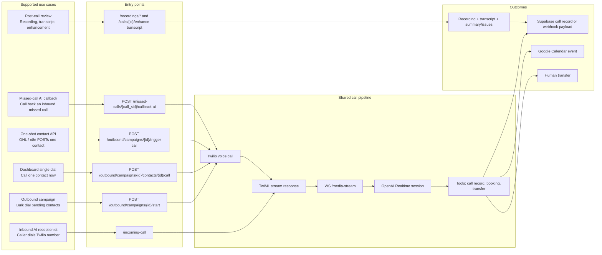
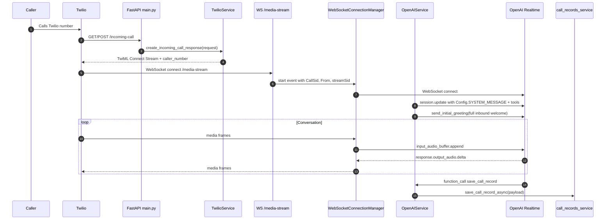
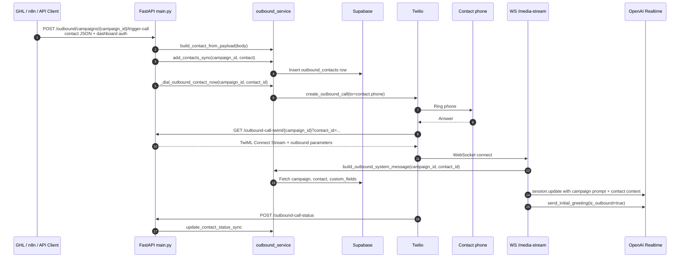
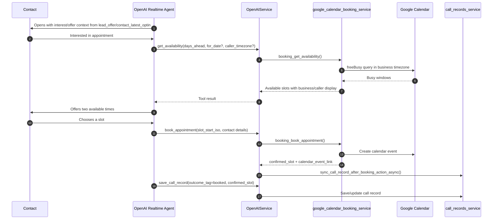
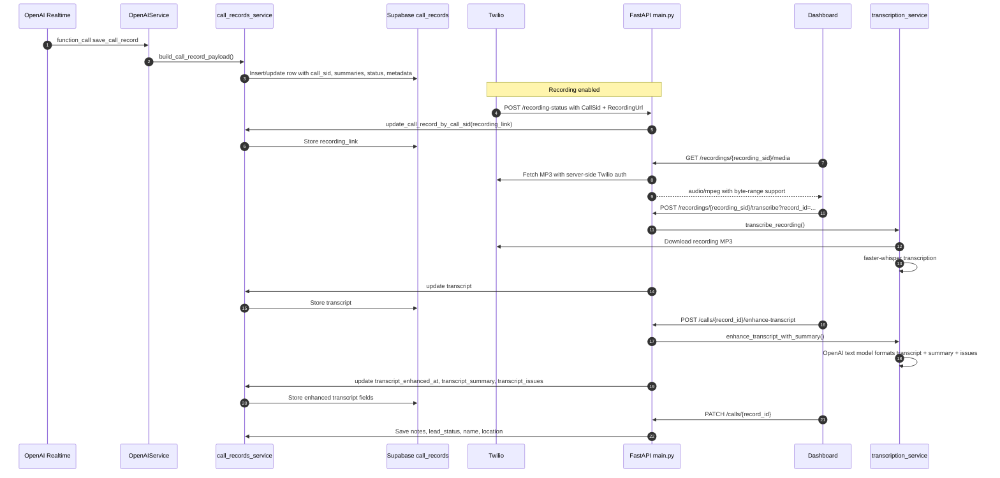

# Copyable Mermaid Architecture Diagrams

Use this file when you want to paste architecture source into ChatGPT, a Mermaid
renderer, or an image-generation prompt. These diagrams describe the current
repo structure: FastAPI + Twilio Media Streams + OpenAI Realtime, with optional
Supabase, outbound campaigns, Google Calendar, recording, and transcription.

## ChatGPT Image 2.0 Prompt

Paste one Mermaid block at a time, then use this prompt:

```text
Create a clean 16:9 technical architecture diagram from this Mermaid source.
Keep the exact components, route names, service names, and data-flow meaning.
Do not invent services or add extra runtime prompts.

Important accuracy rules:
- Show inbound and outbound calls converging on WS /media-stream.
- Show prompts being selected and sent at WS /media-stream via OpenAIService
  session.update, not directly from /incoming-call or /outbound-call-twiml.
- Show exactly one OpenAI Realtime instructions string per call:
  inbound uses Config.SYSTEM_MESSAGE; outbound uses build_outbound_system_message().
- Label prompts/generic_appointment_setter.md as the generic appointment-setter template input.
- Label prompts/aesthetic_appointment_setter.md as an optional sample template input,
  not a separate prompt sent directly to OpenAI.
- Show dynamic_settings.py updating shared Config values for both inbound and outbound.
- Show /outbound-call-status as the outbound completion callback that updates
  outbound contact status.

Use color groups for actors, FastAPI routes, shared realtime core, prompt paths,
Realtime tools, CRM/storage, Google Calendar, and post-call artifacts. Keep the
diagram readable and avoid crossing lines where possible.
```

For the full poster, use the master flowchart. For product demos, use the
use-case flow and one or two sequence diagrams.

---

## 1. Master Flow Diagram

```mermaid
flowchart TB
    subgraph Actors
        Caller["Inbound caller"]
        Callee["Outbound callee"]
        Operator["Dashboard operator"]
        ExternalContact["External contact source<br/>GHL / n8n / API / Insomnia"]
        Human["Human transfer target"]
    end

    subgraph FastAPI["FastAPI app - main.py"]
        Incoming["/incoming-call"]
        OutboundStart["/outbound/campaigns/{id}/start"]
        SingleDial["/outbound/campaigns/{id}/contacts/{id}/call"]
        TriggerCall["/outbound/campaigns/{id}/trigger-call"]
        MissedCallback["/missed-calls/{call_sid}/callback-ai"]
        OutboundTwiML["/outbound-call-twiml/{campaign_id}"]
        OutboundStatus["/outbound-call-status"]
        MediaStream["WS /media-stream"]
        CallsAPI["/calls + /calls/events"]
        RecordingsAPI["/recordings/* + /recording-status"]
        TransferTwiML["/twiml/transfer-to-agent"]
        SettingsAPI["/settings"]
    end

    subgraph RealtimeCore["Shared realtime core"]
        TwilioService["services/twilio_service.py"]
        ConnectionManager["services/connection_manager.py"]
        AudioService["services/audio_service.py"]
        OpenAIService["services/openai_service.py"]
        OpenAIRealtime["OpenAI Realtime API"]
    end

    subgraph Prompting["Prompt paths"]
        ConfigState["config.py shared Config<br/>env + dashboard overrides"]
        InboundPrompt["Inbound instructions<br/>prompts/main_system_instructions.md<br/>system_instructions.py -> Config.SYSTEM_MESSAGE"]
        OutboundPrompt["Outbound instructions<br/>outbound_service.build_outbound_system_message()<br/>campaign template + contact data + contact context"]
        AppointmentPrompt["prompts/generic_appointment_setter.md<br/>template input for campaign_type=appointment_setter"]
        AestheticPrompt["prompts/aesthetic_appointment_setter.md<br/>optional sample template"]
        SessionUpdate["OpenAIService session.update<br/>one instructions string per call"]
    end

    subgraph Tools["Realtime tools"]
        CoreTools["Always registered<br/>wait_for_user<br/>end_call"]
        RecordTool["CRM tool<br/>save_call_record"]
        TransferTool["Transfer tool<br/>request_human_handoff"]
        BookingTools["Booking tools<br/>get_availability<br/>book_appointment<br/>list_my_bookings<br/>edit_booking<br/>delete_booking"]
    end

    subgraph Data["Storage and operations"]
        Supabase["Supabase<br/>call_records / app_settings<br/>outbound_campaigns / outbound_contacts"]
        CallRecords["services/call_records_service.py<br/>facade"]
        WebhookAdapter["services/webhook_service.py<br/>Supabase/webhook adapter"]
        OutboundService["services/outbound_service.py"]
        MissedCalls["services/missed_calls_service.py"]
        DynamicSettings["services/dynamic_settings.py"]
        ExternalCRM["External CRM webhook<br/>WEBHOOK_URL"]
    end

    subgraph Calendar["Google Calendar"]
        BookingService["services/google_calendar_booking_service.py"]
        GoogleCalendar["Google Calendar API"]
    end

    subgraph PostCall["Post-call artifacts"]
        TwilioRecording["Twilio recording"]
        Transcription["services/transcription_service.py<br/>faster-whisper + OpenAI enhancement"]
        Dashboard["static/dashboard.html"]
    end

    Caller --> Twilio["Twilio Voice"]
    Twilio --> Incoming
    Incoming --> TwilioService
    TwilioService -.->|"returns TwiML Connect Stream"| Twilio
    Twilio -->|"opens WebSocket"| MediaStream

    Operator --> OutboundStart
    Operator --> SingleDial
    ExternalContact --> TriggerCall
    Operator --> MissedCallback
    OutboundStart --> OutboundService
    SingleDial --> OutboundService
    TriggerCall --> OutboundService
    MissedCallback --> MissedCalls --> OutboundService
    OutboundService --> Supabase
    OutboundService --> Twilio
    Twilio --> Callee
    Twilio --> OutboundTwiML
    OutboundTwiML --> TwilioService
    TwilioService -.->|"returns TwiML + outbound parameters"| Twilio
    Twilio -->|"answered outbound call opens WebSocket"| MediaStream
    Twilio --> OutboundStatus --> OutboundService

    MediaStream --> ConnectionManager
    ConnectionManager --> AudioService
    ConnectionManager --> OpenAIService
    OpenAIService <--> OpenAIRealtime
    ConnectionManager <--> Twilio

    SettingsAPI --> DynamicSettings --> Supabase
    DynamicSettings -.-> ConfigState
    ConfigState -.-> InboundPrompt
    ConfigState -.-> OutboundPrompt
    MediaStream -.->|"inbound: system_message_override=None"| InboundPrompt
    MediaStream -.->|"outbound: campaign_id + contact_id"| OutboundPrompt
    AppointmentPrompt -.->|"template input only"| OutboundPrompt
    AestheticPrompt -.->|"sample template input only"| OutboundPrompt
    InboundPrompt --> SessionUpdate
    OutboundPrompt --> SessionUpdate
    SessionUpdate --> OpenAIService

    OpenAIService -.->|"registers schemas; handles function calls"| CoreTools
    OpenAIService -.->|"registers schema; handles function call"| RecordTool
    OpenAIService -.->|"registers schema; handles function call"| TransferTool
    OpenAIService -.->|"registers schemas; handles function calls"| BookingTools
    OpenAIRealtime -->|"function_call events"| OpenAIService
    RecordTool --> CallRecords
    TransferTool --> TransferTwiML --> Human
    BookingTools --> BookingService --> GoogleCalendar

    CallRecords --> WebhookAdapter
    WebhookAdapter --> Supabase
    WebhookAdapter --> ExternalCRM
    BookingService -.-> CallRecords

    Dashboard --> CallsAPI --> CallRecords
    Dashboard --> SettingsAPI
    TwilioRecording --> RecordingsAPI --> CallRecords
    RecordingsAPI --> Transcription --> CallRecords

    classDef inbound fill:#e0f2fe,stroke:#0369a1,stroke-width:2px
    classDef outbound fill:#dcfce7,stroke:#166534,stroke-width:2px
    classDef core fill:#ffedd5,stroke:#c2410c,stroke-width:2px
    classDef data fill:#fef9c3,stroke:#a16207,stroke-width:2px
    classDef calendar fill:#fce7f3,stroke:#be185d,stroke-width:2px
    classDef post fill:#ede9fe,stroke:#6d28d9,stroke-width:2px

    class Caller,Incoming,InboundPrompt inbound
    class Callee,ExternalContact,OutboundStart,SingleDial,TriggerCall,MissedCallback,OutboundTwiML,OutboundStatus,OutboundService,MissedCalls,OutboundPrompt,AppointmentPrompt,AestheticPrompt outbound
    class MediaStream,TwilioService,ConnectionManager,AudioService,OpenAIService,OpenAIRealtime,CoreTools,RecordTool,TransferTool,BookingTools,SessionUpdate core
    class Supabase,CallRecords,WebhookAdapter,DynamicSettings,ExternalCRM,CallsAPI,SettingsAPI,ConfigState data
    class BookingService,GoogleCalendar calendar
    class RecordingsAPI,TwilioRecording,Transcription,Dashboard post
```



---

## 2. Use-Case Flow Diagram



---

## 3. Inbound Call Sequence



---

## 4. One-Shot Outbound Contact API Sequence

Use this for GHL, n8n, Insomnia, or any API client that wants to submit one contact
payload and trigger one outbound call against an existing campaign. Lead-shaped
CRM payloads are still accepted for compatibility.



---

## 5. Appointment Setter Booking Sequence



---

## 6. Call Record, Recording, And Transcript Lifecycle



---

## 7. Diagram Use-Case Prompts

Use these prompts with the Mermaid blocks above:

| Use case | Prompt |
| --- | --- |
| Master architecture poster | "Render the master flow as a 16:9 technical architecture poster. Emphasize shared `WS /media-stream`, one OpenAI Realtime `session.update` instructions string per call, inbound vs outbound prompt selection, four outbound triggers, Supabase, Google Calendar, and post-call artifacts." |
| Outbound API demo | "Render the one-shot outbound sequence for GHL/n8n contact intake. Highlight POST `/trigger-call`, Supabase contact insert, Twilio dial, and Realtime prompt construction." |
| Appointment setter demo | "Render the generic appointment setter booking flow. Highlight interest or offer context, availability lookup, two slot choices, Google Calendar booking, and call-record update." |
| Call-record lifecycle | "Render the call-record lifecycle as staged enrichment: live summary, recording link, playback, Whisper transcript, OpenAI enhancement, manual notes/status." |
| Executive overview | "Use the use-case flow diagram. Make it simple and business-readable: inbound, outbound, booking, dashboard, transcript review." |

### Copy-Ready ChatGPT Image 2.0 Prompt

Use this with the **Master Flow Diagram** Mermaid block:

```text
Create a clean 16:9 technical architecture poster from this Mermaid diagram.
Use the Mermaid as the source of truth. Keep all route names, service names,
data stores, tools, and APIs exactly as shown. Do not invent extra services.

Accuracy requirements:
- Inbound and outbound calls must both converge on WS /media-stream.
- /incoming-call and /outbound-call-twiml return TwiML; they do not send prompts
  directly to OpenAI.
- Prompt selection happens at WS /media-stream before OpenAIService sends
  session.update.
- Show exactly one OpenAI Realtime instructions string per call:
  inbound uses Config.SYSTEM_MESSAGE; outbound uses build_outbound_system_message().
- prompts/aesthetic_appointment_setter.md is only an outbound campaign template
  input, not a separate runtime prompt sent directly to OpenAI.
- dynamic_settings.py updates shared Config values used by both inbound and outbound.
- /outbound-call-status is the outbound completion callback that updates contact
  status in Supabase.
- Realtime tools are registered and handled by services/openai_service.py.

Visual style:
- Use grouped sections for Actors, FastAPI routes, Shared Realtime Core, Prompt
  Paths, Realtime Tools, Storage/Operations, Google Calendar, and Post-Call
  Artifacts.
- Use distinct colors for inbound flow, outbound flow, operator/system actions,
  realtime core, storage, calendar, and post-call processing.
- Keep labels readable. Avoid adding decorative icons that obscure the flow.
```
