# Architecture Diagrams

Visual reference for the Twilio + OpenAI Realtime voice-agent starter. Diagrams match the current code in `main.py`, `config.py`, and `services/`.

For narrative context see [Architecture](./ARCHITECTURE.md). For the rendered poster see [`images/MasterArchitectureDiagram.png`](./images/MasterArchitectureDiagram.png) and [Master diagram](./MASTER_DIAGRAM.md). For tool behavior see [Realtime Tools](./TOOLS.md). Quick start checklist: [Onboarding](./ONBOARDING.md).

## Index

| § | Topic |
| --- | --- |
| 1 | [System overview](#1-system-overview) |
| 2 | [Inbound call sequence](#2-inbound-call-sequence) |
| 3 | [Media stream concurrency](#3-media-stream-concurrency) |
| 4 | [Prompt pipeline](#4-prompt-pipeline) |
| 5 | [Realtime tool routing](#5-realtime-tool-routing) |
| 6 | [`wait_for_user` flow](#6-wait_for_user-flow) |
| 7 | [Call record storage](#7-call-record-storage) |
| 8 | [Human transfer](#8-human-transfer) |
| 9 | [Outbound campaign](#9-outbound-campaign) |
| 10 | [Call recording](#10-call-recording-and-transcription) |
| 11 | [Module map](#11-module-map) |
| 12 | [Configuration → behavior](#12-configuration--behavior) |
| 13 | [Google Calendar booking](#13-google-calendar-booking-flow) |
| 14 | [Dashboard authentication](#14-dashboard-authentication) |
| 15 | [Dashboard live updates](#15-dashboard-live-updates) |
| 16 | [Deployment topology](#16-deployment-topology) |
| 17 | [Missed calls + AI callback](#17-missed-calls-and-ai-callback) |
| 18 | [Transcription pipeline](#18-transcription-pipeline) |
| 19 | [First deploy checklist](#19-first-deploy-checklist) |
| 20 | [Dynamic settings](#20-dynamic-settings-dashboard-overrides) |
| 21 | [`end_call` goodbye state machine](#21-end_call-goodbye-state-machine) |
| 22 | [Prompt architecture map](#22-prompt-architecture-map) |
| 23 | [External tools scaffold](#23-external-tools-scaffold-mcp--tool-registry) |

---

## 1. System overview

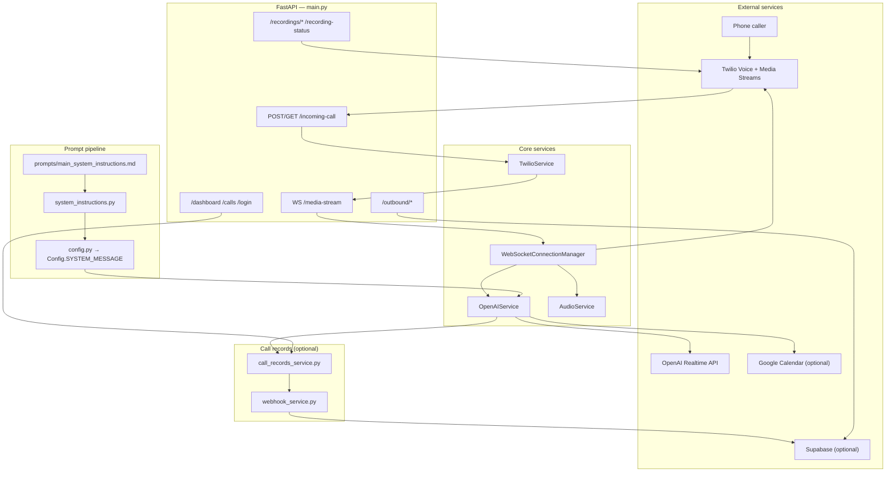

---

## 2. Inbound call sequence

Source: `TwilioService.create_incoming_call_response()` → `handle_media_stream()` in `main.py`.

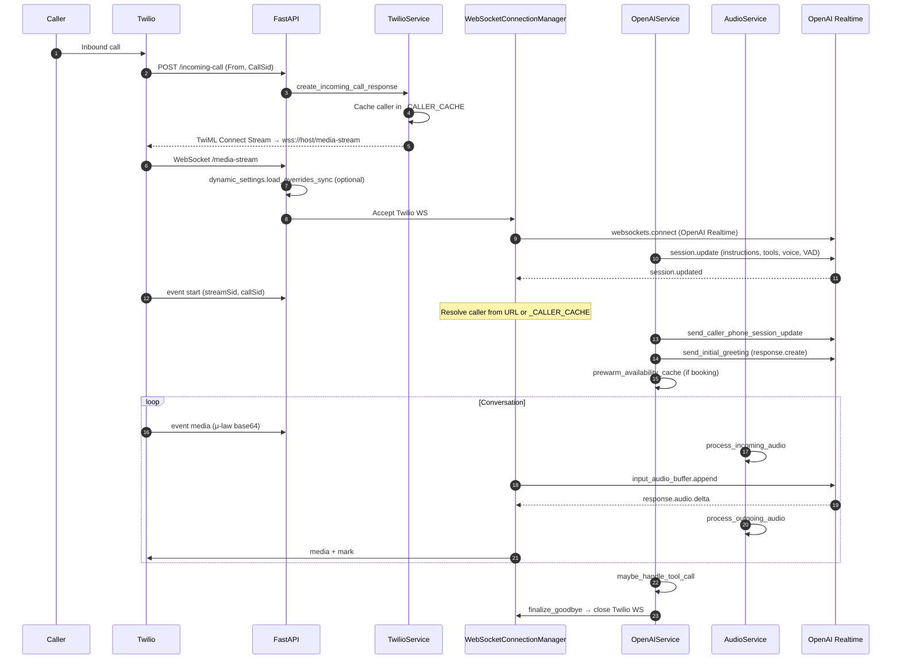

---

## 3. Media stream concurrency

Three coroutines run in `asyncio.gather()` inside `handle_media_stream()`:

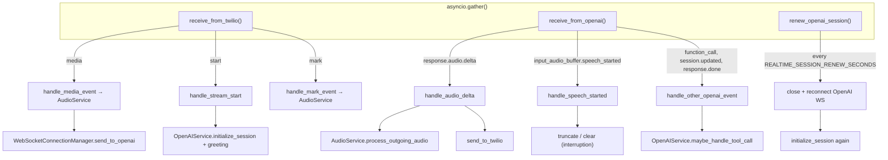

**Interruption guards** (`main.py`):

- Debounce after outgoing audio (`VAD_DEBOUNCE_AFTER_OUTGOING_MS`)
- Optional confirm window (`VAD_INTERRUPTION_CONFIRM_MS`) before truncating
- Goodbye flow is non-interruptible (`is_goodbye_pending()`)

---

## 4. Prompt pipeline

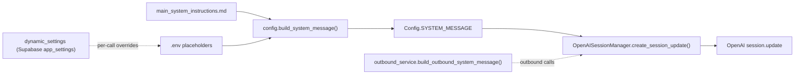

Injected placeholders include: `{agent_name}`, `{company_name}`, `{language_instruction}`, `{accent_instruction}`, `{reasoning_effort_instruction}`, `{tools_availability_instruction}`, `{call_record_instruction}`, `{booking_instruction}`, `{transfer_instruction}`.

For `gpt-realtime-2`, `REALTIME_REASONING_EFFORT` is set on the session payload.

---

## 5. Realtime tool routing

Tools are registered in `OpenAISessionManager._realtime_tools()` and executed in `OpenAIService.maybe_handle_tool_call()`.

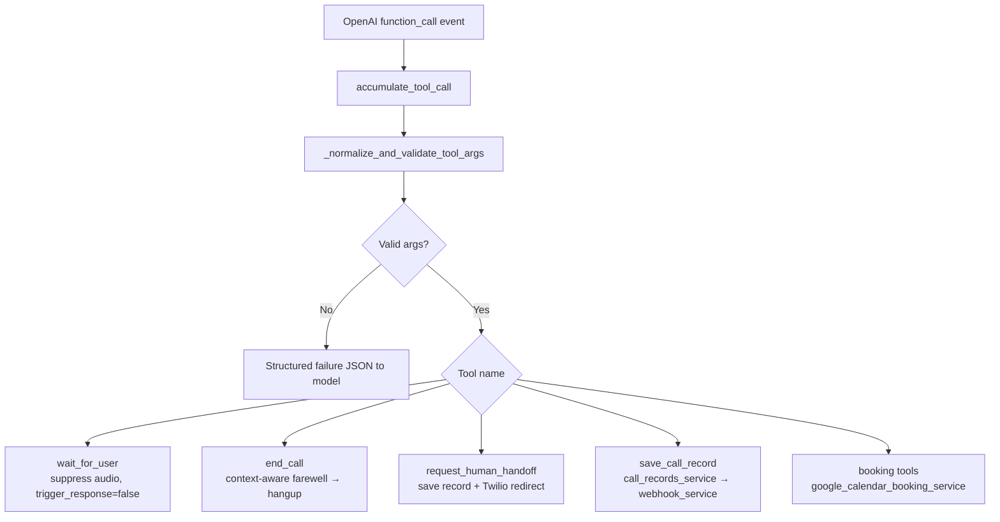

### Tool availability

| Tool | Always | Condition |
| --- | --- | --- |
| `wait_for_user` | Yes | — |
| `end_call` | Yes | — |
| `save_call_record` | No | `has_call_record_backend_configured()` |
| `request_human_handoff` | No | `Config.is_human_transfer_enabled()` |
| `get_availability` | No | Booking + Google Calendar |
| `book_appointment` | No | Booking + Google Calendar |
| `list_my_bookings` | No | Booking + Google Calendar |
| `edit_booking` | No | Booking + Google Calendar |
| `delete_booking` | No | Booking + Google Calendar |

Future external tools: `services/tool_registry.py` + `services/mcp_adapter.py` (disabled by default).

---

## 6. `wait_for_user` flow

```mermaid
sequenceDiagram
    participant O as OpenAI Realtime
    participant M as main.py
    participant OS as OpenAIService
    participant T as Twilio

    O->>M: function_call wait_for_user
    M->>OS: maybe_handle_tool_call
    OS->>OS: suppress_assistant_audio()
    OS->>O: tool output (trigger_response=false)
    M->>OS: finalize_wait_for_user (truncate/clear filler)
    Note over O,T: No spoken reply; VAD resumes when caller addresses agent
```

---

## 7. Call record storage

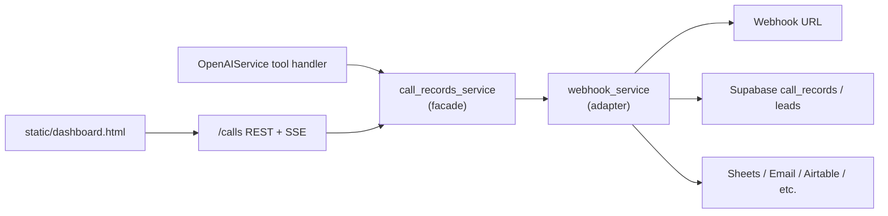

---

## 8. Human transfer

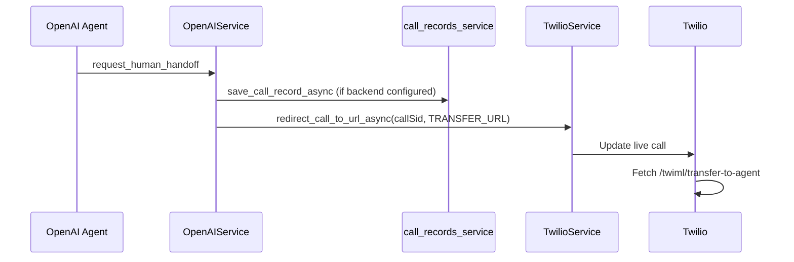

---

## 9. Outbound campaign

Requires `OUTBOUND_ENABLED=true` with Twilio + Supabase.

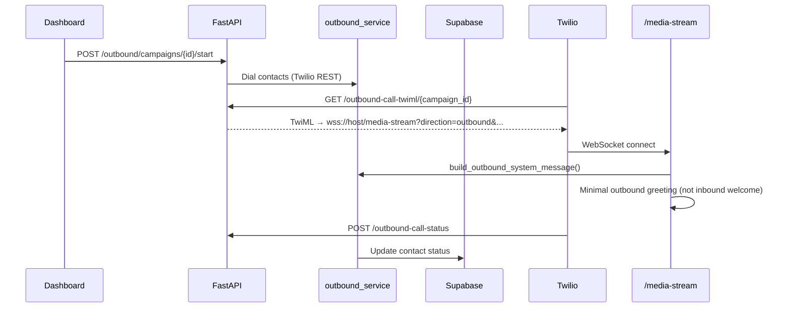

---

## 10. Call recording and transcription

Optional when `CALL_RECORDING_ENABLED` is set.

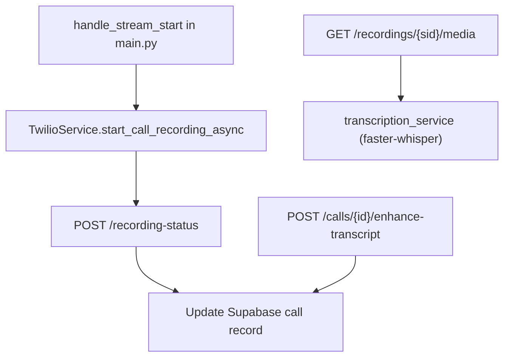

---

## 11. Module map

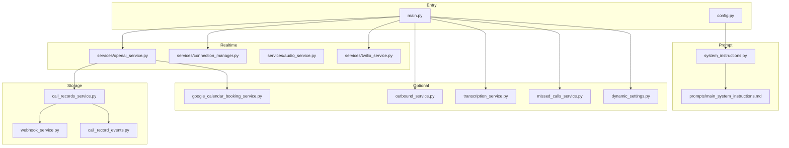

---

## 12. Configuration → behavior

| Setting | Effect |
| --- | --- |
| `OPENAI_API_KEY` | Required — authenticates OpenAI Realtime WebSocket |
| `OPENAI_REALTIME_MODEL=gpt-realtime-2` | Adds `reasoning.effort` to session payload |
| `REALTIME_SESSION_RENEW_SECONDS` | Preemptive session reconnect (default 3300 s) |
| `CALL_RECORD_BACKEND=supabase` | Enables `save_call_record` + dashboard |
| Google Calendar + booking env | Enables five booking tools |
| `HUMAN_TRANSFER_*` | Enables `request_human_handoff` |
| `OUTBOUND_ENABLED=true` | Enables `/outbound/*` campaign APIs |
| `CALL_RECORDING_ENABLED` | Starts Twilio recording on stream start |
| Supabase `app_settings` | Runtime overrides via `dynamic_settings` on connect |

---

## 13. Google Calendar booking flow

Tools run in `OpenAIService.maybe_handle_tool_call()`; calendar I/O is in `google_calendar_booking_service.py` via `run_in_executor` so the event loop stays responsive.

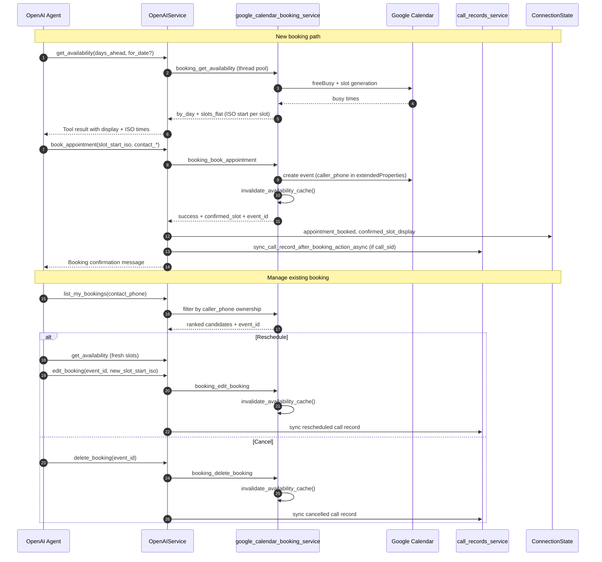

**Cache:** `prewarm_availability_cache()` runs on stream start; mutations invalidate cache so the next `get_availability` reflects updated busy times.

---

## 14. Dashboard authentication

When `DASHBOARD_USERS` is unset, dashboard routes are open. When set, `_require_dashboard_key()` in `main.py` enforces auth.

Format: `DASHBOARD_USERS=user1:pass1,user2:pass2` (parsed in `Config.get_dashboard_auth()`).

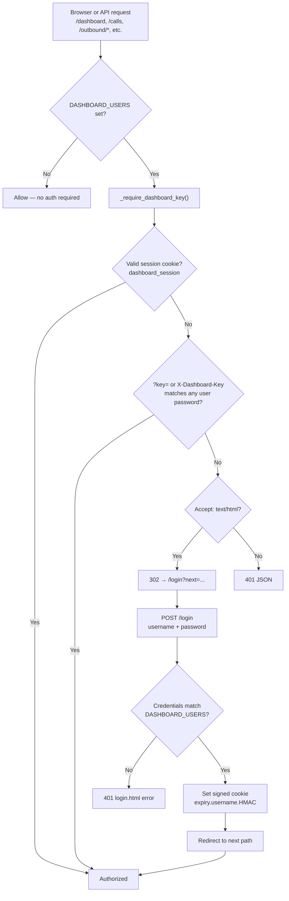

**Session cookie:** HMAC-signed value `expiry.username.sig` (24 h TTL). Signing key is the first user's password from `DASHBOARD_USERS`.

**API note:** `/calls/events` (SSE) accepts cookie or `?key=` because browser `EventSource` cannot send custom headers.

---

## 15. Dashboard live updates

Requires `CALL_RECORD_BACKEND=supabase`.

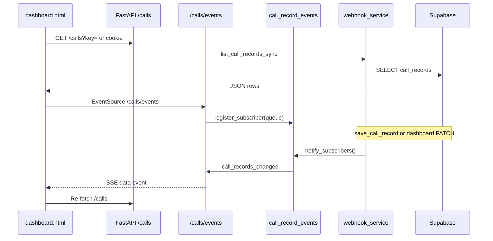

---

## 16. Deployment topology

Production path: `./scripts/deploy-cloudrun.sh` → Google Cloud Run service `speech-assistant` (region `us-central1`, timeout 3600 s).

Local dev: `python main.py` + ngrok for Twilio webhook.

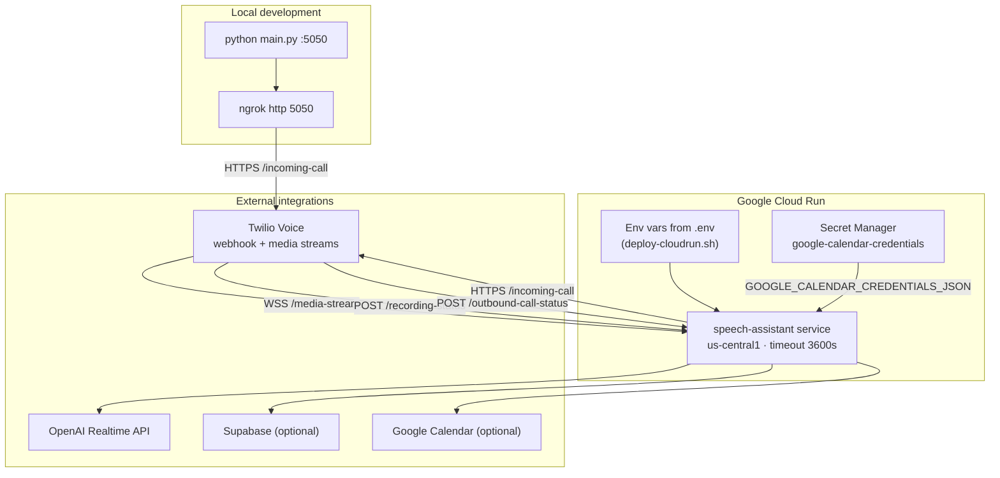

**Deploy script skips:** `PORT` (Cloud Run sets it), `GOOGLE_CALENDAR_CREDENTIALS_JSON` and `GOOGLE_APPLICATION_CREDENTIALS` as local file paths — mount via Cloud Run secrets instead.

**Post-deploy:** Point Twilio Voice webhook to `{SERVICE_URL}/incoming-call`. If recording is enabled, set `RECORDING_STATUS_CALLBACK_BASE_URL` to the service URL.

---

## 17. Missed calls and AI callback

Source: `services/missed_calls_service.py`, `/missed-calls/*` in `main.py`.

A missed call is either:
1. Twilio inbound status in `{no-answer, busy, failed, canceled}`, or
2. Inbound `completed` with **no** Supabase call-record row (caller hung up before `save_call_record`).

Handled calls (`lead_status=missed_handled`) are hidden from the list.

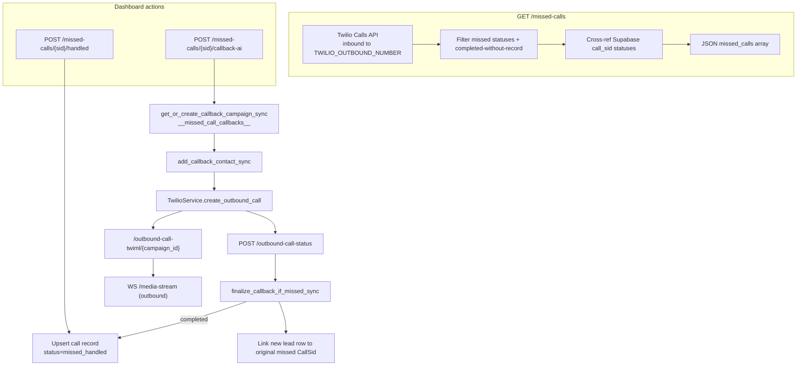

**Requirements:** Twilio credentials for list/dial; Supabase for AI callback (reuses outbound pipeline); public `OUTBOUND_BASE_URL` (not localhost).

---

## 18. Transcription pipeline

Post-call transcription uses **faster-whisper**; optional OpenAI chat enhancement formats dialogue and adds summary/issues.

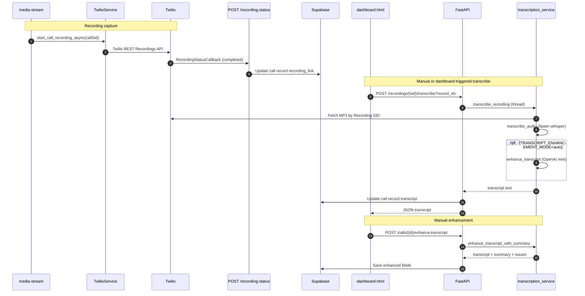

| Step | Env / gate |
| --- | --- |
| Start recording | `CALL_RECORDING_ENABLED=true` + `RECORDING_STATUS_CALLBACK_BASE_URL` |
| Whisper transcribe | `TRANSCRIPTION_MODEL` (e.g. `tiny`) + Twilio credentials |
| Auto-enhance on transcribe | `TRANSCRIPT_ENHANCEMENT_MODE=auto` |
| Manual enhance button | `TRANSCRIPT_ENHANCEMENT_MODE=manual` + Supabase backend |
| Playback in dashboard | `GET /recordings/{sid}/media` (server-side Twilio Basic Auth proxy) |

---

## 19. First deploy checklist

End-to-end path from zero to a working phone agent with optional dashboard.

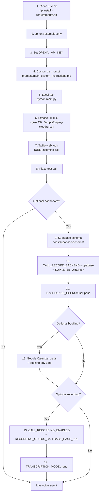

### Minimum viable (phone agent only)

| # | Action | Verify |
| --- | --- | --- |
| 1 | Set `OPENAI_API_KEY` | App starts without config error |
| 2 | Run `python main.py` | Listening on port 5050 |
| 3 | Public HTTPS URL (ngrok or Cloud Run) | Twilio can reach webhook |
| 4 | Twilio Voice → `{URL}/incoming-call` | Inbound call connects to AI |
| 5 | Edit `prompts/main_system_instructions.md` | Agent behavior matches intent |

### Optional layers (enable in order)

| Layer | Key env vars | Unlocks |
| --- | --- | --- |
| Dashboard | `CALL_RECORD_BACKEND=supabase`, Supabase creds, `DASHBOARD_USERS` | `/dashboard`, `save_call_record` tool |
| Booking | Google Calendar JSON + `GOOGLE_CALENDAR_ID` + booking flags | Five calendar tools |
| Outbound | `OUTBOUND_ENABLED=true`, Twilio + Supabase, `OUTBOUND_BASE_URL` | Campaign dial APIs |
| Recording | `CALL_RECORDING_ENABLED`, `RECORDING_STATUS_CALLBACK_BASE_URL` | Twilio recordings on call records |
| Transcription | `TRANSCRIPTION_MODEL` | Whisper transcribe from dashboard |
| Missed calls | Twilio creds + Supabase | `/missed-calls`, AI callback |

---

## 20. Dynamic settings (dashboard overrides)

Source: `services/dynamic_settings.py`, `GET/PATCH /settings` in `main.py`.

Overrides load from Supabase `app_settings` when `CALL_RECORD_BACKEND=supabase`. Applied on every `/media-stream` connect and when the dashboard opens Settings.

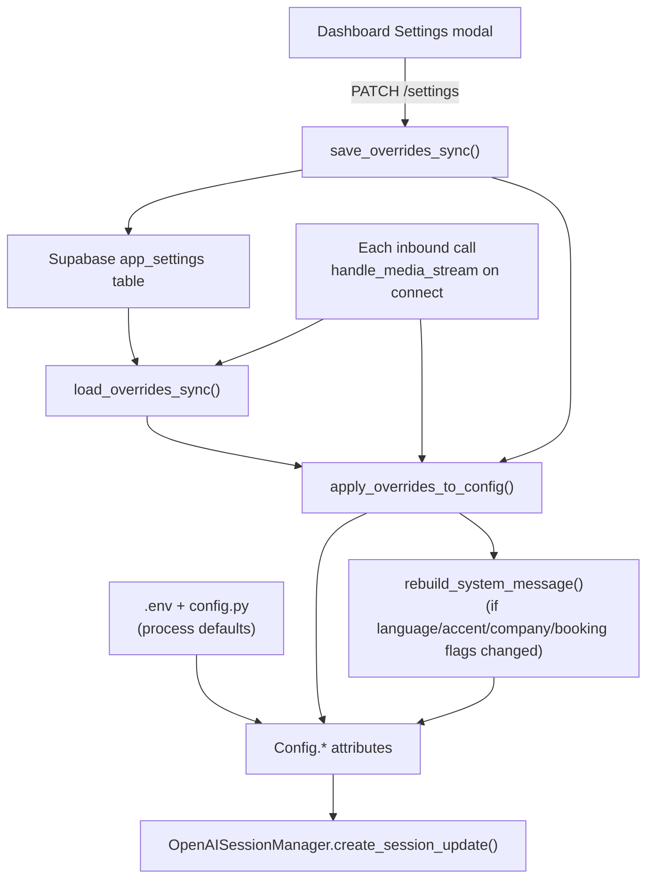

### Override categories (selected keys)

| Category | Example keys |
| --- | --- |
| Voice / model | `VOICE`, `OPENAI_REALTIME_MODEL`, `REALTIME_REASONING_EFFORT`, `TEMPERATURE` |
| Language / accent | `ASSISTANT_LANGUAGE`, `ASSISTANT_ACCENT`, `LANGUAGE_SWITCH_POLICY` |
| VAD | `VAD_MODE`, `VAD_THRESHOLD`, `VAD_DEBOUNCE_AFTER_OUTGOING_MS`, `VAD_INTERRUPTION_CONFIRM_MS` |
| Booking | `BOOKING_ENABLED`, `BOOKING_DAYS_ENABLED`, `GOOGLE_CALENDAR_ID`, slot hours |
| Ops | `CALL_RECORDING_ENABLED`, `TRANSCRIPTION_MODEL`, `HUMAN_TRANSFER_ENABLED` |

Prompt-affecting keys trigger `rebuild_system_message()`; booking keys also sync to `os.environ` for calendar helpers.

---

## 21. `end_call` goodbye state machine

Source: `OpenAIService.maybe_handle_tool_call()` + `main.py` event handlers.

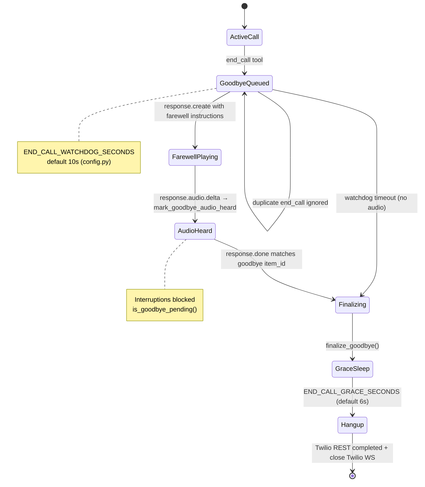

### Context-aware farewell text

`get_farewell_instruction()` in `system_instructions.py` picks instructions based on `ConnectionState`:

| State | Farewell emphasis |
| --- | --- |
| `appointment_booked` + `confirmed_slot_display` | Confirm appointment time |
| `priority` = emergency/high/urgent | Time-sensitive follow-up |
| `call_record_saved` | Details saved for team |
| Default | Brief polite goodbye |

---

## 22. Prompt architecture map

How the starter aligns behavior across markdown, config, and runtime. Full guide mapping: [STARTER_PROMPT_MAPPING.md](./references/STARTER_PROMPT_MAPPING.md).

```mermaid
flowchart LR
    subgraph Static["Static behavior"]
        MD["main_system_instructions.md<br/>Role, flow, tools rules, safety"]
    end

    subgraph Injected["config.py builders"]
        LANG["language_instruction"]
        ACC["accent_instruction"]
        REAS["reasoning_effort_instruction"]
        TOOLS["tools_availability_instruction"]
        CR["call_record_instruction"]
        BK["booking_instruction"]
        TR["transfer_instruction"]
    end

    subgraph Runtime["Runtime assembly"]
        RENDER["system_instructions.render_system_instructions()"]
        MSG["Config.SYSTEM_MESSAGE"]
        SESS["session.update instructions"]
        TOOLREG["OpenAISessionManager._realtime_tools()"]
    end

    MD --> RENDER
    LANG & ACC & REAS & TOOLS & CR & BK & TR --> RENDER
    RENDER --> MSG --> SESS
    TOOLREG --> SESS

    DYN["dynamic_settings<br/>(Supabase app_settings)"] -.->|rebuild on change| MSG
    OUT["outbound_system_message"] -.->|outbound calls| SESS
```

### Where to change what

| Goal | Edit first |
| --- | --- |
| Agent behavior / conversation rules | `prompts/main_system_instructions.md` |
| Language, accent, reasoning effort | `.env` or dashboard Settings (`dynamic_settings`) |
| Tool availability text in prompt | `config.py` builders (driven by env flags) |
| Tool schemas + side effects | `services/openai_service.py` |
| Greeting / farewell phrasing | `system_instructions.py` |
| OpenAI Realtime alignment audit | [openai-realtime-models-prompting.md](./references/openai-realtime-models-prompting.md) |

After prompt or builder changes: `pytest tests/test_system_instructions.py`.

---

## 23. External tools scaffold (MCP + tool registry)

The starter ships a **disabled-by-default** extension point for tools beyond the built-in set. Built-in tools stay in `openai_service.py`; external tools register through `tool_registry.py`.

```mermaid
flowchart TD
    subgraph Builtin["Built-in (always in openai_service.py)"]
        BT["wait_for_user, end_call"]
        COND["save_call_record, booking, transfer<br/>(conditional on config)"]
    end

    subgraph Scaffold["Extension scaffold (v1 no-op)"]
        REG["ToolRegistry<br/>external_tool_registry"]
        MCP["mcp_adapter.load_mcp_tools()"]
        REGIST["RegisteredTool<br/>name + schema + handler"]
    end

    subgraph Session["Session registration"]
        RT["_realtime_tools()"]
        SESS["session.update tools array"]
    end

    subgraph Dispatch["Runtime dispatch"]
        MHC["maybe_handle_tool_call()"]
        HAND["registered_tool.handler(args, connection_manager)"]
        OUT["_send_tool_result → OpenAI"]
    end

    BT --> RT
    COND --> RT
    MCP --> REG
    REGIST --> REG
    REG --> RT
    RT --> SESS

    MHC -->|built-in names| Builtin
    MHC -->|unknown name| REG
    REG -->|handler set| HAND --> OUT
    REG -->|no handler| OUT
```

### Integration steps (when implementing MCP)

Documented in `services/mcp_adapter.py`:

1. Load allowed MCP servers/tools from config.
2. Convert MCP tool schemas to OpenAI Realtime function schemas.
3. Register via `external_tool_registry.register(RegisteredTool(...))`.
4. `load_mcp_tools()` runs inside `_realtime_tools()` before session start.
5. `maybe_handle_tool_call()` dispatches to `handler` after built-in tools miss.

### Current v1 behavior

| Component | Status |
| --- | --- |
| `services/tool_registry.py` | `ToolRegistry` + empty `external_tool_registry` |
| `services/mcp_adapter.py` | `load_mcp_tools()` is a no-op |
| `openai_service.py` | Imports registry; extends tools list; dispatches external handlers |
| Prompt | Built-in tools only — external tools need prompt text when enabled |

No MCP runtime dependency is bundled in the starter requirements.

