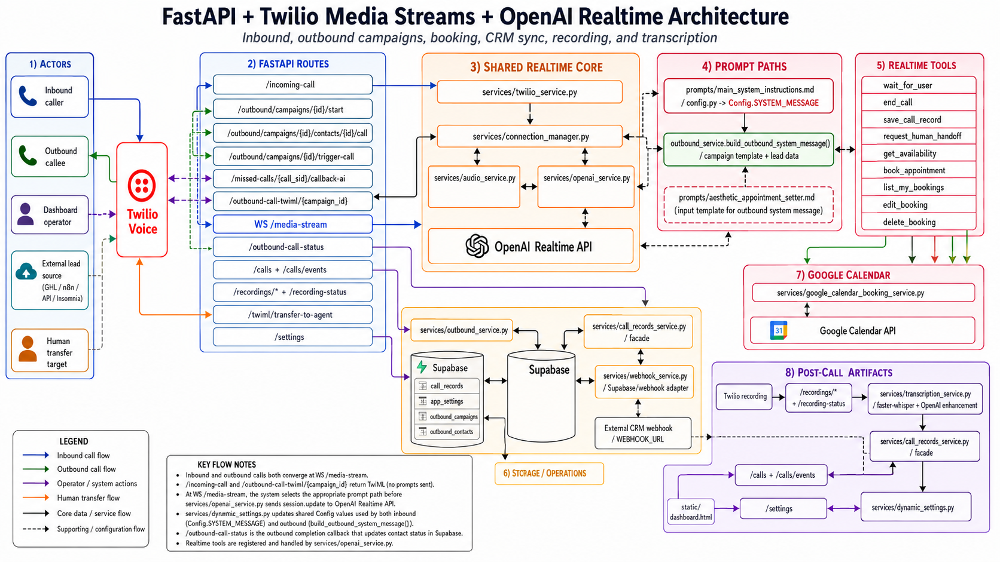
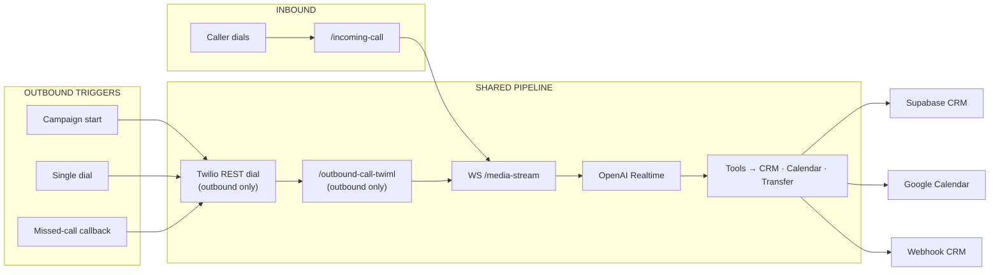
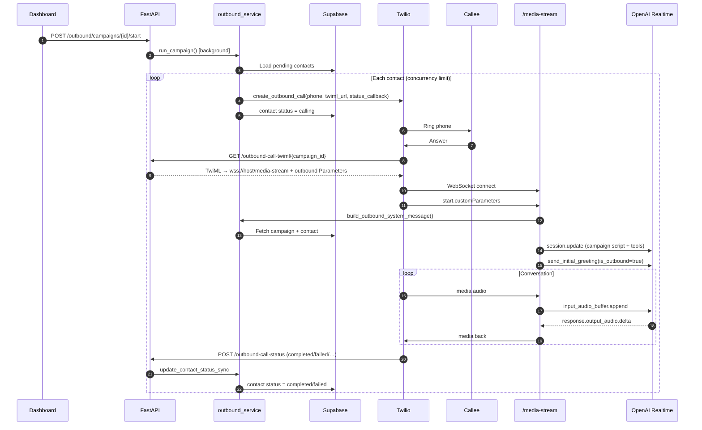

# Master Architecture Diagram

Single-page visual reference for the Twilio + OpenAI Realtime voice-agent starter. Use this file when sharing architecture with image-generation tools (e.g. ChatGPT) or onboarding stakeholders.



For detailed per-topic flows, see [Diagrams](./DIAGRAMS.md) (23 indexed sections). Narrative context: [Architecture](./ARCHITECTURE.md).

---

## Step-by-step breakdown

### Step 1 — Two call directions

| Direction | Who initiates | Entry point |
| --- | --- | --- |
| **Inbound** | Caller dials your Twilio number | `POST/GET /incoming-call` |
| **Outbound** | Your app dials the callee via Twilio REST | `TwilioService.create_outbound_call()` |

Both directions **converge on the same WebSocket bridge**: `WS /media-stream` → `WebSocketConnectionManager` → `OpenAIService` → OpenAI Realtime.

### Step 2 — Outbound triggers (3 paths, 1 pipeline)

Outbound is not only campaigns. Three triggers share the same dial → TwiML → media-stream path:

| Trigger | API / source | What happens |
| --- | --- | --- |
| **① Campaign bulk dial** | `POST /outbound/campaigns/{id}/start` | `run_campaign()` dials all `pending` contacts with concurrency control |
| **② Single contact dial** | `POST /outbound/campaigns/{id}/contacts/{id}/call` | Dials one contact manually from dashboard |
| **③ Missed-call AI callback** | `POST /missed-calls/{call_sid}/callback-ai` | Creates/reuses hidden campaign `__missed_call_callbacks__`, adds contact, then dials |

**Shared outbound pipeline (all three):**

```
Dashboard trigger
  → outbound_service (Supabase campaign + contact)
  → TwilioService.create_outbound_call()
  → Twilio rings callee
  → GET /outbound-call-twiml/{campaign_id}
  → WSS /media-stream + Twilio Stream Parameters (direction, campaign_id, contact_id)
  → build_outbound_system_message() (campaign template + placeholders)
  → OpenAI Realtime conversation
  → POST /outbound-call-status → update Supabase contact status
```

Campaign type presets (`services/outbound_campaign_types.py`): `promo`, `appointment_confirmation`, `payment_reminder`, `follow_up`, `general`, `missed_call_callback`.

### Step 3 — Inbound path

```
Caller → Twilio → POST /incoming-call
  → TwiML Connect Stream → WSS /media-stream
  → dynamic_settings overrides (optional, from Supabase app_settings)
  → Config.SYSTEM_MESSAGE (inbound prompt)
  → send_initial_greeting() (full welcome)
  → conversation loop until end_call or disconnect
```

### Step 4 — Shared realtime core (both directions)

Once `/media-stream` connects, inbound and outbound use the same runtime:

| Component | Role |
| --- | --- |
| `WebSocketConnectionManager` | Bridges Twilio WS ↔ OpenAI Realtime WS |
| `AudioService` | μ-law encode/decode, interruption handling |
| `OpenAIService` | Session, tools, VAD guards, goodbye state machine |
| **3 coroutines** | `receive_from_twilio()` · `receive_from_openai()` · `renew_openai_session()` |

**Only difference at connect time:**

| | Inbound | Outbound |
| --- | --- | --- |
| Prompt | `Config.SYSTEM_MESSAGE` | `build_outbound_system_message()` override |
| Greeting | Full inbound welcome | Minimal opener (`is_outbound=true`) |
| Caller phone | From Twilio `From` / cache | From Supabase contact record |

### Step 5 — CRM / data layer (Supabase + alternatives)

**Supabase is the primary CRM** when `CALL_RECORD_BACKEND=supabase`:

| Supabase table | Purpose |
| --- | --- |
| `call_records` (or `leads`) | CRM-style call records from `save_call_record`; `call_sid` stores the latest call and metadata tracks primary/related calls |
| `app_settings` | Runtime overrides via `dynamic_settings.py` |
| `outbound_campaigns` | Campaign definitions + scripts |
| `outbound_contacts` | Contacts, dial status, `call_sid` |

**Data flow:**

```
OpenAIService tool (save_call_record)
  → call_records_service.py (facade)
  → webhook_service.py (adapter)
  → Supabase OR external CRM webhook
```

**Alternative CRM backends** (`CALL_RECORD_BACKEND`):

| Backend | Status |
| --- | --- |
| `webhook` | POST to `WEBHOOK_URL` (Zapier, custom CRM, etc.) |
| `supabase` | Fully implemented (dashboard, SSE, booking sync) |
| `googlesheets`, `email`, `airtable`, `sms`, `telegram`, `slack` | Scaffolded in `webhook_service.py` |

### Step 6 — Google Calendar (optional booking lane)

When `BOOKING_ENABLED=true` + Google Calendar credentials:

| Tool | Service |
| --- | --- |
| `get_availability` | `google_calendar_booking_service.py` |
| `book_appointment` | Creates Calendar event + syncs call record |
| `list_my_bookings` | Filters by caller phone ownership |
| `edit_booking` / `delete_booking` | Reschedule/cancel + cache invalidation |

Runs inside `OpenAIService.maybe_handle_tool_call()` via thread pool (`run_in_executor`). Availability cache pre-warmed on stream start.

### Step 7 — Other integrations

| Integration | When active | Role |
| --- | --- | --- |
| **Twilio** | Always | Voice, Media Streams, recordings, outbound REST dial, human transfer redirect |
| **OpenAI Realtime** | Always | Speech AI, tools, VAD, optional reasoning effort |
| **Dashboard** | Supabase + auth optional | `/dashboard`, `/calls`, `/outbound/*`, `/missed-calls`, `/settings`, SSE live updates |
| **Human transfer** | `HUMAN_TRANSFER_ENABLED` | `request_human_handoff` → `/twiml/transfer-to-agent` |
| **Recording** | `CALL_RECORDING_ENABLED` | Twilio recording → `/recording-status` → Supabase |
| **Transcription** | `TRANSCRIPTION_MODEL` | faster-whisper transcript from recording + optional OpenAI enhancement summary/issues |
| **MCP / tool registry** | Disabled scaffold | Future external tools via `tool_registry.py`, `mcp_adapter.py` |

### Step 8 — Environment cheat sheet

| Lane | Key settings |
| --- | --- |
| Core agent | `OPENAI_API_KEY`, Twilio webhook → `/incoming-call` |
| Outbound (all 3 triggers) | `OUTBOUND_ENABLED=true`, Twilio creds, Supabase, `OUTBOUND_BASE_URL` (public HTTPS) |
| Supabase CRM + dashboard | `CALL_RECORD_BACKEND=supabase`, `SUPABASE_URL`, `SUPABASE_KEY`, optional `DASHBOARD_USERS` |
| Webhook CRM | `CALL_RECORD_BACKEND=webhook`, `WEBHOOK_URL` |
| Google Calendar | `BOOKING_ENABLED=true`, `GOOGLE_CALENDAR_ID`, credentials JSON |
| Missed-call callback | Twilio creds + Supabase (reuses outbound pipeline) |
| Recording + transcription | `CALL_RECORDING_ENABLED`, `TRANSCRIPTION_MODEL` |
| Human transfer | `HUMAN_TRANSFER_URL`, `HUMAN_TRANSFER_DIAL_NUMBER` |

---

## Master diagram

Paste into ChatGPT or any Mermaid renderer. Ask for **one subgraph per image** for best results.

```mermaid
flowchart TB
    %% VOICE AGENT STARTER — MASTER ARCHITECTURE
    %% Inbound + Outbound (campaign + trigger-based) + CRM + Calendar
    %% Source: main.py · config.py · services/* · prompts/*

    subgraph ACTORS["👥 ACTORS"]
        direction LR
        CALLER["📞 Inbound Caller"]
        CALLEE["📞 Outbound Callee"]
        HUMAN["👤 Human Agent<br/>(transfer target)"]
        OPS["🖥️ Dashboard Operator"]
    end

    subgraph TELECOM["☁️ TELECOM & AI (always on)"]
        direction LR
        TWILIO["Twilio<br/>Voice · Media Streams · Recordings · REST Dial"]
        OPENAI["OpenAI Realtime API<br/>Speech · Tools · VAD · Reasoning"]
    end

    subgraph TRIGGERS["🎯 CALL TRIGGERS"]
        direction TB

        subgraph INBOUND_T["INBOUND"]
            T_IN["Caller dials Twilio number"]
        end

        subgraph OUTBOUND_T["OUTBOUND — 3 trigger paths"]
            direction TB
            T_CAMP["① Campaign bulk<br/>POST /outbound/campaigns/{id}/start<br/>→ run_campaign()"]
            T_ONE["② Single contact<br/>POST …/contacts/{id}/call"]
            T_MISS["③ Missed-call AI callback<br/>POST /missed-calls/{sid}/callback-ai<br/>→ __missed_call_callbacks__ campaign"]
        end
    end

    subgraph ROUTES["⚡ FASTAPI ROUTES — main.py"]
        direction TB

        subgraph ENTRY["Entry routes"]
            R_IN["/incoming-call<br/>inbound TwiML"]
            R_OT["/outbound-call-twiml/{campaign_id}<br/>outbound TwiML on answer"]
            R_OS["POST /outbound-call-status<br/>contact status webhook"]
        end

        subgraph BRIDGE["Shared audio bridge"]
            R_MS["WS /media-stream<br/>inbound OR outbound Parameters"]
        end

        subgraph OPS_ROUTES["Dashboard & ops APIs"]
            R_DASH["/dashboard · /calls · /login · /settings"]
            R_SSE["SSE /calls/events"]
            R_OUT_API["/outbound/* CRUD + start/pause/stop"]
            R_MISS_API["/missed-calls/*"]
            R_REC["/recordings/* · /recording-status"]
            R_XFER["/twiml/transfer-to-agent"]
        end
    end

    subgraph CORE["🔧 SHARED REALTIME CORE (inbound + outbound)"]
        direction LR
        WCM["WebSocketConnectionManager<br/>Twilio WS ↔ OpenAI WS"]
        OS["OpenAIService<br/>session · tools · goodbye · VAD"]
        AS["AudioService<br/>μ-law · interruption guards"]
        CON["3 coroutines<br/>recv_twilio · recv_openai · renew_session"]
    end

    subgraph PROMPTS["📝 PROMPT PATHS (diverge here, merge at session.update)"]
        direction TB
        P_IN["INBOUND PROMPT<br/>main_system_instructions.md<br/>→ system_instructions.py<br/>→ config.py → Config.SYSTEM_MESSAGE<br/>+ dynamic_settings overrides"]
        P_OUT["OUTBOUND PROMPT<br/>build_outbound_system_message()<br/>campaign message_template<br/>+ {contact_name} {company_name} placeholders<br/>+ delivery/language/accent policy"]
        P_GREET_IN["send_initial_greeting<br/>(full inbound welcome)"]
        P_GREET_OUT["send_initial_greeting(is_outbound=true)<br/>(minimal opener)"]
    end

    subgraph TOOLS["🔨 REALTIME TOOLS — openai_service.py"]
        direction TB
        T_CORE["Always: wait_for_user · end_call"]
        T_CRM_T["CRM: save_call_record"]
        T_XFER_T["Ops: request_human_handoff"]
        T_CAL_T["Calendar: get_availability · book_appointment<br/>list_my_bookings · edit_booking · delete_booking"]
        T_EXT["Future: tool_registry · mcp_adapter"]
    end

    subgraph CRM["💾 CRM & DATA LAYER"]
        direction TB

        subgraph FACADE["App facade"]
            CRS["call_records_service.py"]
            WH["webhook_service.py<br/>(storage adapter)"]
        end

        subgraph SUPA["Supabase CRM (primary)"]
            direction LR
            SB_LEADS["call_records / leads<br/>save_call_record · dashboard · SSE"]
            SB_SETTINGS["app_settings<br/>dynamic_settings overrides"]
            SB_CAMP["outbound_campaigns"]
            SB_CONT["outbound_contacts"]
        end

        subgraph ALT_CRM["Alternative backends (CALL_RECORD_BACKEND)"]
            direction LR
            WH_URL["webhook → WEBHOOK_URL<br/>(Zapier · custom CRM)"]
            ALT["googlesheets · email · airtable<br/>sms · telegram · slack<br/>(scaffolded)"]
        end

        EV["call_record_events.py<br/>SSE live push to dashboard"]
    end

    subgraph GCAL["📅 GOOGLE CALENDAR (optional)"]
        GBS["google_calendar_booking_service.py<br/>freeBusy · slot gen · create/edit/delete events<br/>availability cache · caller_phone ownership"]
        GCAPI["Google Calendar API<br/>(service account)"]
    end

    subgraph POST["📼 POST-CALL & OPS (optional)"]
        TX["transcription_service.py<br/>faster-whisper + OpenAI enhance"]
        REC["Twilio call recording<br/>→ /recording-status"]
    end

    %% INBOUND PATH
    T_IN --> CALLER --> TWILIO
    TWILIO -->|"POST /incoming-call"| R_IN
    R_IN -->|"TwiML Stream"| R_MS

    %% OUTBOUND PATHS
    OPS --> T_CAMP & T_ONE & T_MISS
    OPS --> R_OUT_API & R_MISS_API
    T_CAMP & T_ONE & T_MISS --> OBS["outbound_service.py"]
    OBS --> SB_CAMP & SB_CONT
    OBS -->|"Twilio REST dial"| TWILIO
    TWILIO -->|"callee answers"| R_OT
    R_OT -->|"TwiML Stream + outbound params"| R_MS
    TWILIO -->|"status on hangup"| R_OS --> OBS --> SB_CONT

    %% SHARED BRIDGE
    R_MS --> WCM
    TWILIO <-->|"WSS μ-law audio"| R_MS
    WCM <-->|"WSS Realtime"| OPENAI
    R_MS --> CON --> WCM & AS & OS

    %% PROMPT DIVERGENCE
    R_IN -.-> P_IN
    R_OT -.-> P_OUT
    P_IN --> OS
    P_OUT --> OS
    SB_SETTINGS -.->|"load_overrides on connect"| P_IN
    SB_CAMP & SB_CONT -.-> P_OUT
    OS --> P_GREET_IN & P_GREET_OUT

    %% TOOLS
    OPENAI -->|"function_call"| OS
    T_CORE & T_CRM_T & T_XFER_T & T_CAL_T & T_EXT --> OS
    T_CRM_T --> CRS
    T_XFER_T --> TS["TwilioService<br/>redirect · record · dial"]
    T_CAL_T --> GBS --> GCAPI
    TS --> R_XFER --> HUMAN

    %% CRM WRITES
    CRS --> WH
    WH --> SB_LEADS & WH_URL & ALT
    WH --> EV --> R_SSE
    GBS -.->|"sync after booking"| CRS
    R_DASH --> CRS & SB_SETTINGS & OBS
    R_DASH --> R_OUT_API

    %% POST-CALL
    R_MS -.-> REC --> R_REC --> SB_LEADS
    R_REC --> TX --> SB_LEADS

    %% RETURN AUDIO
    WCM --> TWILIO
    TWILIO --> CALLER & CALLEE

    classDef inbound fill:#E3F2FD,stroke:#1565C0,stroke-width:2px
    classDef outbound fill:#E8F5E9,stroke:#2E7D32,stroke-width:2px
    classDef core fill:#FFF3E0,stroke:#EF6C00,stroke-width:2px
    classDef crm fill:#FFF8E1,stroke:#F9A825,stroke-width:2px
    classDef calendar fill:#FCE4EC,stroke:#C2185B,stroke-width:2px
    classDef external fill:#ECEFF1,stroke:#455A64,stroke-width:2px

    class T_IN,R_IN,P_IN,P_GREET_IN inbound
    class T_CAMP,T_ONE,T_MISS,R_OT,R_OS,OBS,P_OUT,P_GREET_OUT outbound
    class R_MS,WCM,OS,AS,CON core
    class CRS,WH,SB_LEADS,SB_SETTINGS,SB_CAMP,SB_CONT,EV,WH_URL,ALT crm
    class GBS,GCAPI,T_CAL_T calendar
    class TWILIO,OPENAI,TS external
```



---

## Convergence diagram

How inbound and all outbound triggers merge on the shared pipeline:



---

## Outbound sequence

For a detailed outbound-only image:



---

## Using with ChatGPT (image generation)

Render **one zone per image** from the Master diagram for best results.

| Zone | Suggested prompt seed |
| --- | --- |
| **Call Triggers** | Split: left inbound (caller dials in), right three outbound triggers converging on Twilio |
| **Shared Core** | Center hub: `/media-stream` bridge between Twilio and OpenAI with AudioService and 3 coroutines |
| **Prompt Paths** | Fork: inbound markdown prompt vs outbound Supabase campaign template, merging at session.update |
| **CRM Layer** | Supabase tables (leads, campaigns, contacts, app_settings) plus webhook to external CRM |
| **Google Calendar** | Five booking tools → google_calendar_booking_service → Google Calendar API |

**Full poster prompt:**

> Technical architecture poster for a Twilio + OpenAI voice agent. Top row: Inbound caller and 3 outbound triggers. Center: shared WebSocket media bridge. Bottom left: Supabase CRM. Bottom right: Google Calendar booking. Side: Dashboard operator. Color code: blue=inbound, green=outbound, orange=core, yellow=CRM, pink=calendar. Clean vector, 16:9.

---

## Truthfulness & optional gates

The PNG poster (`images/MasterArchitectureDiagram.png`) matches the architecture above when read with these code-accurate caveats:

| Topic | Accurate in diagram | Caveat |
| --- | --- | --- |
| Shared `/media-stream` core | Yes | Same bridge for inbound and all outbound triggers |
| Outbound trigger ③ (missed-call callback) | Yes | Does **not** require `OUTBOUND_ENABLED`; **does** require Supabase + public `OUTBOUND_BASE_URL` |
| Outbound triggers ①② | Yes | Require `OUTBOUND_ENABLED=true` + Twilio + Supabase |
| Realtime coroutines | Yes | `receive_from_twilio()`, `receive_from_openai()`, `renew_openai_session()` |
| Prompt paths | Yes | Outbound uses Supabase `message_template` (no industry YAML profiles) |
| Greetings | Yes | Inbound = full welcome; outbound = minimal “begin now” |
| Tools | Mostly | `save_call_record`, booking, and transfer are **conditional on env**, not always registered |
| CRM | Mostly | **Supabase** = full dashboard, SSE, outbound, settings; **webhook** = lead POST only |
| Alt CRM backends | Yes if labeled scaffolded | Sheets, email, Airtable, SMS, Telegram, Slack are enum placeholders only |
| Transcription | Yes | **faster-whisper** (local), optional OpenAI enhance; triggered via dashboard/API, not automatic on every call |
| Dashboard auth | Not shown | Routes are open unless `DASHBOARD_USERS` is set |

---

## Related docs

| Topic | Doc |
| --- | --- |
| Detailed per-flow diagrams (23 sections) | [DIAGRAMS.md](./DIAGRAMS.md) |
| Module narrative | [ARCHITECTURE.md](./ARCHITECTURE.md) |
| Tool behavior | [TOOLS.md](./TOOLS.md) |
| Env vars | [CONFIGURATION.md](./CONFIGURATION.md) |
| First deploy | [ONBOARDING.md](./ONBOARDING.md) |
