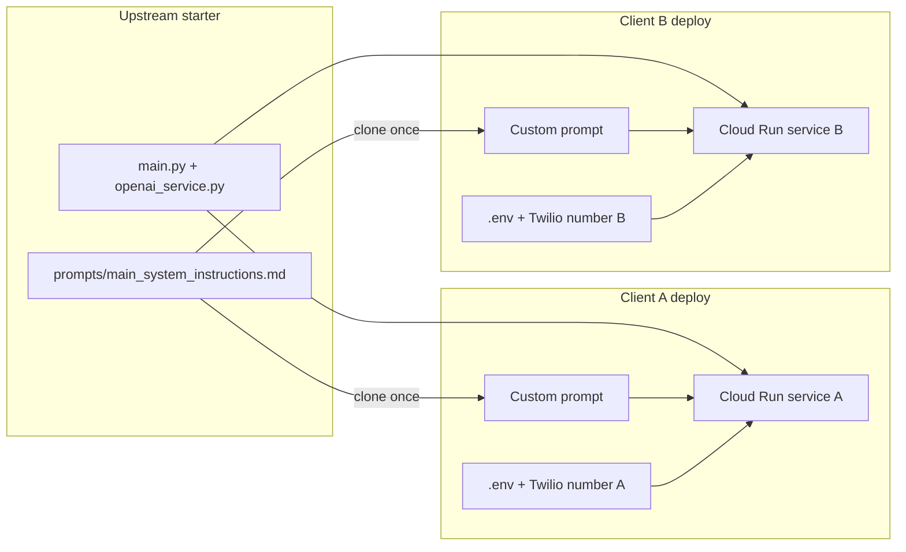

# Multi-Client Voice Agent Workflow

How to build a new voice agent for each client (real estate, lead qualifier, intake, etc.) using this starter as an upstream template.

**Model:** one client = one clone, one `.env`, one prompt, one Twilio number, one deploy. The starter repo stays generic; client-specific work lives in separate projects.

Related guides: [Onboarding](./ONBOARDING.md) · [Prompt-as-code](./PROMPT_AS_CODE.md) · [Configuration](./CONFIGURATION.md) · [Starter prompt mapping](./references/STARTER_PROMPT_MAPPING.md)

---

## Short answer on folders

**Do not** turn the starter repo into a multi-industry folder tree (no `profiles/realestate.yaml`, no `clients/acme/` inside the starter). See [AGENTS.md](../AGENTS.md): *"Do not add industry/profile YAML files back into this starter."*

**Do** create a **separate project per client** when you need concurrent production agents:

```text
voice-agents/
  starter/                    # upstream template — pull updates, rarely client-specific
  acme-realestate/            # clone of starter, customized for Client A
  leadco-qualifier/           # clone of starter, customized for Client B
  other-client/               # clone of starter, customized for Client C
```

Each client folder is a full copy of the starter with its own `.env`, prompt, Twilio number, and Cloud Run service. One deployment = one agent personality.

Optional within a **client** repo only: keep the generic prompt and add a client-specific file, then point env at it:

```env
SYSTEM_INSTRUCTIONS_PATH=prompts/acme_realestate.md
AGENT_LABEL=acme_realestate
```

That keeps client prompts out of the shared starter without building multi-tenant routing or Supabase prompt-profile infrastructure.

---

## Mental model



| Changes per client | Stays shared (upstream) |
| --- | --- |
| Prompt, `.env`, greeting | Bugfixes, Realtime session logic |
| Optional tools / feature flags | Core bridge (`main.py`, `openai_service.py`) |
| Twilio webhook, deploy target | Prompt structure and Realtime-aligned sections |

---

## Step-by-step workflow (every new client)

### Step 1 — Discovery (before touching code)

Use the fillable template: [Client discovery template](./templates/CLIENT_DISCOVERY.md) — copy it per client before cloning the starter.

Summary questions:

| Question | Why it matters |
| --- | --- |
| Primary goal | Intake? Qualify leads? Book showings? Answer FAQs? Transfer hot leads? |
| Required data fields | Name, phone, budget, timeline, property type, etc. |
| Integrations | Supabase dashboard, Google Calendar, CRM webhook, live transfer |
| Voice / language | `VOICE`, `ASSISTANT_ACCENT`, `LANGUAGE_SWITCH_POLICY` |
| Success criteria | What makes a "good" call? What gets saved? |

Map answers to starter capabilities:

| Need | Where to implement |
| --- | --- |
| Lead capture / qualification | Prompt + `save_call_record` (no code change for basic fields) |
| Appointment booking | `BOOKING_ENABLED=true` + `GOOGLE_CALENDAR_ID` + credentials |
| Human escalation | `HUMAN_TRANSFER_URL` + `HUMAN_TRANSFER_DIAL_NUMBER` + Twilio creds |
| Outbound calling | `OUTBOUND_ENABLED=true` + Twilio + Supabase + `OUTBOUND_BASE_URL` |
| New CRM fields or APIs | Extend `save_call_record` in `services/openai_service.py` |

---

### Step 2 — Create the client project

```bash
git clone <starter-repo-url> acme-realestate
cd acme-realestate
cp .env.example .env
```

- Use a **dedicated git repo** (or private fork) per client so secrets, deploy config, and prompt history stay isolated.
- Keep the starter as read-only upstream; merge or cherry-pick starter improvements into client repos periodically.

---

### Step 3 — Set identity and features in `.env`

**Always required:**

```env
OPENAI_API_KEY=sk-...
COMPANY_NAME=Acme Realty
AGENT_NAME=Sarah
AGENT_LABEL=acme_realty          # tags call records (stored as industry + agent_label)
SYSTEM_INSTRUCTIONS_PATH=prompts/main_system_instructions.md
```

**Optional features — enable only what this client needs.** Each feature has env prerequisites; if they are missing, the tool is not registered at runtime (see [Configuration](./CONFIGURATION.md)):

| Client need | Env / setup | Runtime effect |
| --- | --- | --- |
| Dashboard + call history | `CALL_RECORD_BACKEND=supabase`, `SUPABASE_URL`, `SUPABASE_KEY`, run `docs/supabase-schema/call_records_schema.sql`, optional `DASHBOARD_USERS` | Registers `save_call_record`; enables `/dashboard` |
| CRM webhook | `CALL_RECORD_BACKEND=webhook`, `WEBHOOK_URL` (optional `WEBHOOK_SECRET`) | Registers `save_call_record`; POSTs payload on save |
| Showings / appointments | `BOOKING_ENABLED=true`, `GOOGLE_CALENDAR_ID`, `GOOGLE_CALENDAR_CREDENTIALS_JSON` | Registers all 5 booking tools only when calendar creds load |
| Transfer to agent | `HUMAN_TRANSFER_URL` (e.g. `{HOST}/twiml/transfer-to-agent`), `HUMAN_TRANSFER_DIAL_NUMBER`, `TWILIO_ACCOUNT_SID`, `TWILIO_AUTH_TOKEN`; set `HUMAN_TRANSFER_ENABLED=false` to disable | Registers `request_human_handoff` when URL is set |
| Outbound lead dialer | `OUTBOUND_ENABLED=true`, Twilio creds, Supabase, `OUTBOUND_BASE_URL` | Campaign APIs in dashboard; separate from inbound prompt |

**Important:** `save_call_record` is **not** available with the default `.env.example` alone — `CALL_RECORD_BACKEND=webhook` requires a non-empty `WEBHOOK_URL`, or use Supabase. Without a configured backend, the agent can still talk but cannot persist leads.

---

### Step 4 — Customize behavior in the prompt (first and main edit)

Edit `prompts/main_system_instructions.md` (or a client copy via `SYSTEM_INSTRUCTIONS_PATH`).

If you use a separate prompt file, **copy the full starter file first** — it must keep all nine placeholders (`{agent_name}`, `{company_name}`, `{language_instruction}`, etc.) or `config.py` rendering will break. See `system_instructions.py` → `REQUIRED_PROMPT_PLACEHOLDERS`.

**Edit order** (matches [Starter prompt mapping](./references/STARTER_PROMPT_MAPPING.md)):

1. **`# Role and Objective`** — industry role, goals, boundaries (replace "generic business voice agent")
2. **`# Conversation Flow`** — intake / qualification script (one question at a time)
3. **`# Entity Capture`** — client-specific fields and collection order (budget, property type, etc. can live here as spoken fields mapped into `issue_summary` / `call_summary`)
4. **`# Tools`** — when to save, book, transfer, end call (feature blocks `{call_record_instruction}`, `{booking_instruction}`, `{transfer_instruction}` are injected from env)
5. **`# Safety`** — what not to promise (pricing, legal advice, etc.)

**Leave unchanged unless you have a specific reason:** `# Reasoning`, `# Handling Silence`, `# Unclear Audio`, `# Preambles`, `# Verbosity`, `# Instruction Precision`, `# End Call` — these are Realtime-aligned mechanics.

After edits:

```bash
python scripts/preview_system_prompt.py
pytest tests/test_system_instructions.py
```

In a **client repo**, you may need to relax tests that assert `"generic business voice agent"` or `"industry" not in prompt` once you customize for a vertical.

---

### Step 5 — Tune voice and greeting (quick wins)

| Goal | Where |
| --- | --- |
| Spoken business + agent name | `.env`: `COMPANY_NAME`, `AGENT_NAME` |
| Custom opening line | `.env`: `WELCOME_MESSAGE` or `GREETING` (supports `{company_name}`, `{agent_name}`) |
| Voice, accent, reasoning | `.env`: `VOICE`, `ASSISTANT_*`, `REALTIME_REASONING_EFFORT` |
| Farewell wording | `system_instructions.py` → `get_farewell_instruction()` — only if env defaults are not enough |

---

### Step 6 — Extend tools only when the prompt is not enough

Stay in the prompt if `save_call_record` fields cover the need: `contact_name`, `issue_summary`, `priority`, `call_summary`, `service_address`, etc.

Change code when you need:

| Need | Where |
| --- | --- |
| New structured fields on the record | Tool schema + handler in `services/openai_service.py`; payload in `services/call_records_service.py` |
| External API (MLS, CRM) | Handler in `openai_service.py` or future `services/tool_registry.py` / MCP scaffold |
| Different booking rules | `services/google_calendar_booking_service.py` + booking env vars |

Rule from [AGENTS.md](../AGENTS.md): behavior in prompt first; side effects in Python.

---

### Step 7 — Deploy and wire Twilio

1. Run locally: `python main.py` (default port `5050`) + `ngrok http 5050` for first test call
2. Set `RECORDING_STATUS_CALLBACK_BASE_URL` and `OUTBOUND_BASE_URL` to your public host when those features are enabled
3. Production: `./scripts/deploy-cloudrun.sh` ([Cloud Run Deploy](./DEPLOY_CLOUD_RUN.md))
4. Point **this client's Twilio number** Voice webhook to `{SERVICE_URL}/incoming-call`
5. Place 3–5 test calls; review dashboard or webhook payloads

Each client gets its **own** Cloud Run service, `.env`, and Twilio number. Inbound audio works with `OPENAI_API_KEY` alone; Twilio REST creds are needed for reliable hangup, recording, transfer, and outbound.

---

### Step 8 — Iterate from real calls

- Review call records / transcripts in dashboard or webhook
- Tighten prompt sections that fail (ambiguous rules, wrong tool timing)
- Use OpenAI guide audit prompts in [openai-realtime-models-prompting.md](./references/openai-realtime-models-prompting.md) (Instructions Quality / Prompt Optimization)
- Re-run `pytest tests/test_system_instructions.py` after prompt changes

---

## Example client types

### Real estate

**Goal:** Capture buyer/seller intent, schedule showings, save leads.

| Layer | Customization |
| --- | --- |
| Prompt | Role = listing/showing assistant; collect property interest, budget range, timeline, preferred areas; offer booking for showings |
| `.env` | `BOOKING_ENABLED=true` if showings on calendar; Supabase or webhook for leads |
| Tools | Default `save_call_record` + booking tools; `service_address` for property location |
| Transfer | Enable if caller wants a specific agent |

### Lead qualifier

**Goal:** Short qualification call; score and route leads.

| Layer | Customization |
| --- | --- |
| Prompt | Fixed qualification flow (3–6 questions); define hot/warm/cold in `# Conversation Flow`; instruct when to transfer vs save-only |
| `.env` | `AGENT_LABEL=leadco_qualifier`; webhook to CRM; optional `HUMAN_TRANSFER_*` for qualified leads |
| Tools | Heavy use of `save_call_record` with `priority` + detailed `call_summary`; optional outbound campaigns |
| Booking | Usually off |

### Other use cases

Same pattern:

1. Write Role + Flow for their use case
2. List entities to capture in `# Entity Capture`
3. Toggle features in `.env`
4. Add custom tools only for integrations the generic record cannot represent

---

## Worked example: real estate (discovery → deploy)

This walks one client from discovery to a live agent. Adapt the same steps for lead qualifier or other verticals.

### A. Discovery (filled excerpt)

| Item | Answer |
| --- | --- |
| Company | Acme Realty |
| Agent | Sarah |
| Goal | Capture buyer/seller intent, book showings, save leads |
| Questions | 1) Buy or sell? 2) Areas of interest 3) Budget range 4) Timeline 5) Name + callback number |
| Save when | Name, phone, intent, and at least one of budget/timeline/area collected |
| Book when | Caller wants a showing and picks a slot |
| Integrations | Supabase dashboard + Google Calendar |
| `AGENT_LABEL` | `acme_realty` |

### B. Clone and `.env`

```bash
git clone <starter-url> acme-realestate && cd acme-realestate
cp .env.example .env
```

```env
OPENAI_API_KEY=sk-...
COMPANY_NAME=Acme Realty
AGENT_NAME=Sarah
AGENT_LABEL=acme_realty

CALL_RECORD_BACKEND=supabase
SUPABASE_URL=...
SUPABASE_KEY=...
DASHBOARD_USERS=admin:...

BOOKING_ENABLED=true
GOOGLE_CALENDAR_ID=...
GOOGLE_CALENDAR_CREDENTIALS_JSON=...

TWILIO_ACCOUNT_SID=...
TWILIO_AUTH_TOKEN=...
```

### C. Prompt edits (sections only)

**`# Role and Objective`** — replace generic scope:

```markdown
You are {agent_name} for {company_name}. You are a real estate phone assistant. Your goal is to understand whether the caller is buying or selling, capture property preferences and timeline, schedule showings when requested, and save leads for agent follow-up. Do not quote prices, negotiate, or give legal advice.
```

**`# Conversation Flow`** — add scripted intake:

```markdown
For new buyer or seller inquiries, ask one question at a time in this order when details are missing: buy or sell, preferred areas, budget range, timeline, then name and best callback number. Offer to check showing availability when they want to visit a property. Confirm phone digit-by-digit before save_call_record or booking.
```

**`# Entity Capture`** — add under the bullet list:

```markdown
- Buy vs sell intent and property type when relevant.
- Preferred neighborhoods or areas.
- Budget range and move timeline when the caller is shopping.
- Property address or area for showings in service_address when provided.
```

**`# Safety`** — add:

```markdown
Do not state listing prices, commission rates, or legal conclusions. Offer to have an agent follow up for specifics.
```

Leave `# Handling Silence`, `# Unclear Audio`, `# Preambles`, etc. unchanged.

### D. Verify and ship

```bash
pytest tests/test_system_instructions.py   # relax generic-agent assertions in client repo if needed
python main.py
ngrok http 5050
```

Twilio webhook → `https://<ngrok-host>/incoming-call`. Place test calls: FAQ, full intake, showing booking, goodbye.

Production: `./scripts/deploy-cloudrun.sh` → point client Twilio number at Cloud Run URL.

### E. Iterate

Review first 10 Supabase records. Common prompt fixes: tool called too early, slot list too long, missing budget confirmation. Re-run pytest after each prompt edit.

---

## What not to do

- **Don't** add industry YAML/profile folders back into the starter
- **Don't** run multiple unrelated clients on one deployment without building tenant routing (not in starter today)
- **Don't** fork Python for conversational logic — keep it in the markdown prompt
- **Don't** skip confirmation rules for phone/email before `save_call_record` or booking writes

---

## Suggested folder layout for an agency

```text
~/voice-agents/
  Twilio-speech-assistant-openai-realtime-api-python/   # starter (upstream)
  clients/
    acme-realestate/
      prompts/main_system_instructions.md   # or prompts/acme_realestate.md
      .env                                    # never commit
    leadco-qualifier/
    dental-office-intake/
```

| Repo type | Purpose |
| --- | --- |
| **Starter repo** | Generic, tested, documented — your factory template |
| **Client repos** | Prompt + env + deploy + optional tool extensions — your deliverables |

---

## Checklist per new client

- [ ] Fill [Client discovery template](./templates/CLIENT_DISCOVERY.md)
- [ ] Clone starter → new repo
- [ ] `.env`: `OPENAI_API_KEY`, identity, `AGENT_LABEL`, feature flags (with full prerequisites)
- [ ] Prompt: Role, Flow, Entity Capture, Tools, Safety
- [ ] Greeting / voice tuning
- [ ] `pytest tests/test_system_instructions.py`
- [ ] Test call via ngrok
- [ ] Deploy + Twilio webhook
- [ ] Review first 10 calls and iterate prompt
